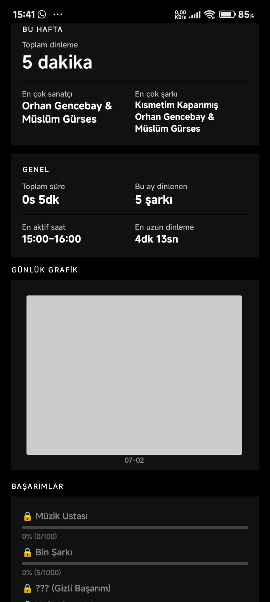
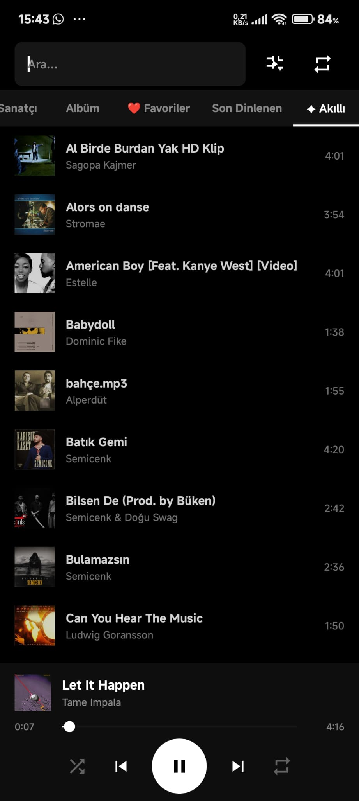

# MPlayer 🎵

> Minimal Bir MP3 Çalar Android İçin. No ads, no bloat, no internet.

---

## 📥 Download

- [GitHub Releases](https://github.com/codetabsite/Mplayer/releases)
- F-Droid — Coming Soon

---

## 🎵 Playback

| Feature | Description |
|---|---|
| Waveform Seekbar | Visual waveform for precise navigation |
| A-B Loop | Repeat any custom section of a song |
| Crossfade | Smooth transition between tracks |
| Playback Speed | 0.5x to 2x speed control |
| Mono Mode | Merge stereo to mono |
| Volume Normalization | Consistent volume across tracks |
| Silence Trimming | Auto-skip silent parts |
| Shake to Skip | Shake your phone to skip track |

---

## 🎨 Interface

| Feature | Description |
|---|---|
| Vinyl Animation | Rotating CD/vinyl with album art |
| Dynamic Theming | Colors adapt to album art palette |
| Dark UI | Clean minimal dark interface |
| Waveform Display | Real-time audio waveform |

---

## 📋 Library Management

| Feature | Description |
|---|---|
| Smart Browse | All, Artist, Album, Favorites, Recent, Smart |
| Instant Search | Search songs, artists, albums instantly |
| Duplicate Cleaner | Find and remove duplicate songs |
| Folder Blacklist | Exclude specific folders from library |
| Trash / Recycle Bin | Recover deleted songs |

---

## ❤️ Extra Features

| Feature | Description |
|---|---|
| Favorites | Mark and browse favorite songs |
| Sleep Timer | Auto-stop after set time |
| Lyrics Editor | Create and sync LRC format lyrics |
| Ringtone Maker | Trim any song and save as ringtone |
| Song Notes | Add personal notes to songs |
| Headset Controls | Full headset button support |
| Bluetooth Controls | MediaSession integration |
| Notification Player | Full controls in notification |
| Queue Management | Add to queue, play next |

---

## 📊 Statistics & Achievements

| Feature | Description |
|---|---|
| Weekly Stats | Listening time, top artist, top song |
| Overall Stats | Total duration, peak hour, longest session |
| Daily Chart | Bar chart of daily listening activity |
| Genre Distribution | Pie chart of your genre preferences |
| Most Played | Top songs by play count |
| Achievement System | Unlock achievements as you listen |
| Recently Played | History of last played songs |
| Forgotten Songs | Songs not played in 6+ months |

---

## 🌍 Languages

- 🇬🇧 English
- 🇹🇷 Turkish
- 🇩🇪 German
- 🇨🇳 Chinese
- 🇯🇵 Japanese
- 🇪🇸 Spanish

---

## 🛠 Tech Stack

- **Language:** Kotlin 100%
- **Min SDK:** Android 8.0 (API 26)
- **Target SDK:** Android 14 (API 34)
- **Build System:** Gradle (Kotlin DSL)
- **Database:** Room
- **Image Loading:** Glide
- **License:** Apache-2.0
- **No analytics, no ads SDK, no internet permission**

---

## 📸 Screenshots

| Library | Now Playing | Statistics |
|---|---|---|
| 

 | 

 | 

---

## 🤝 Contributing

Contributions are welcome!

1. Fork the repo
2. Create a branch: `git checkout -b feature/my-feature`
3. Commit: `git commit -m "Add my feature"`
4. Push: `git push origin feature/my-feature`
5. Open a Pull Request

Please read [CODE_OF_CONDUCT.md](CODE_OF_CONDUCT.md) before contributing.

---

## ⭐ Support

If you like MPlayer:
- ⭐ Star the repository
- 🐛 Report bugs via [Issues](https://github.com/codetabsite/Mplayer/issues)
- 🌍 Help with translations
- 📢 Share with friends
- 🔀 Contribute code

---

## 📄 License
Apache-2.0 — see [LICENSE](LICENSE)
